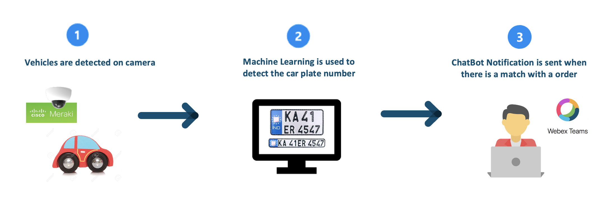
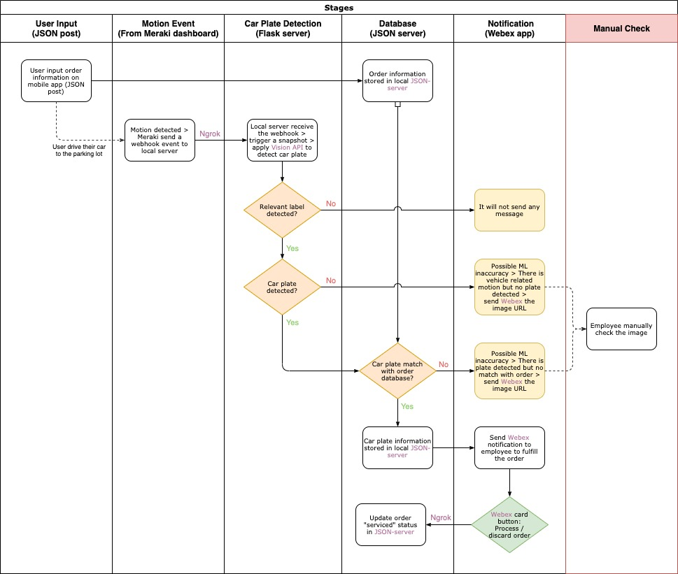
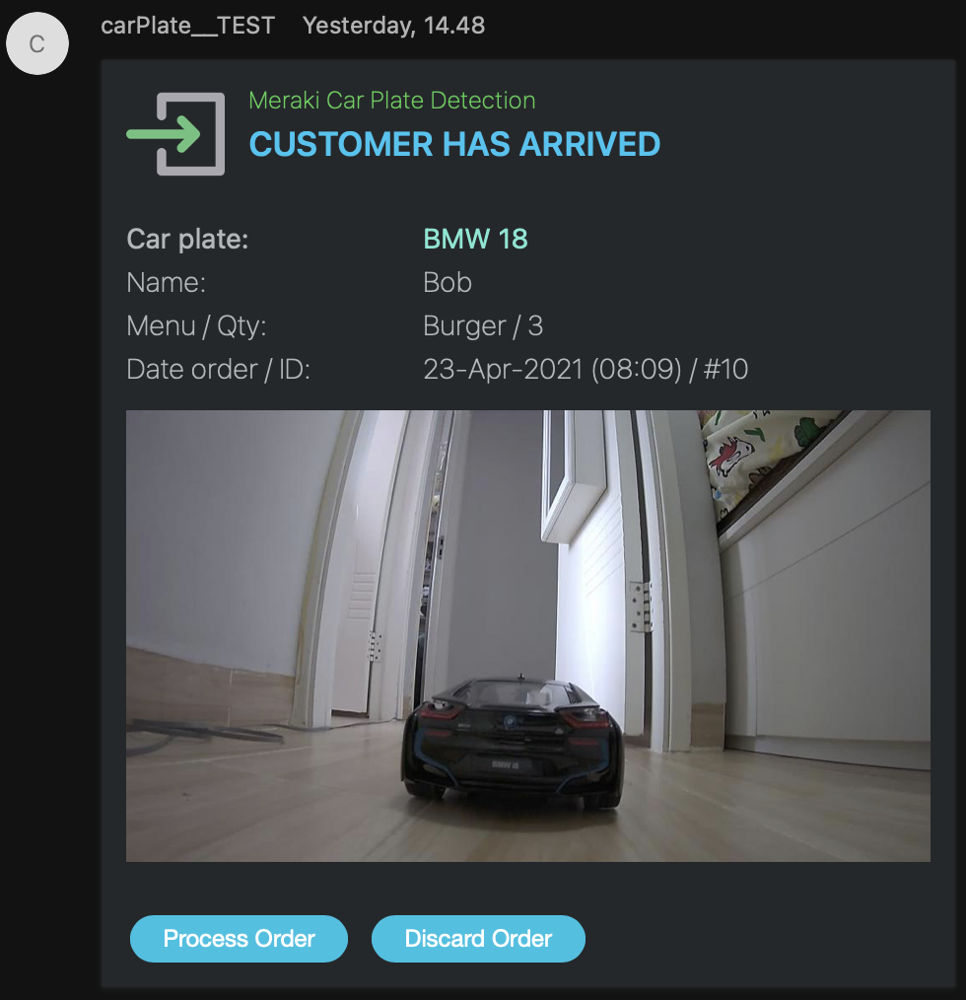

# Meraki Vehicle Arrival and License Plate Detection

A proof of concept that detects an arriving vehicle with a Meraki MV camera, reads its license plate, matches it to a pickup order, and alerts staff in Webex.

> This repository contains legacy demonstration code with 2021-era dependencies. It is intended for a controlled lab, not direct production deployment.

## What this repository does

The project connects a camera event to a pickup workflow:

1. A customer order, including the vehicle plate, is stored in a small JSON database.
2. A Meraki MV motion alert calls the Flask `/webhook` endpoint.
3. The server waits for the vehicle to stop, requests up to three camera snapshots, and uses Google Cloud Vision to detect vehicle-related labels and read text.
4. The detected text is compared with the latest matching order.
5. The arrival is recorded and a Webex adaptive card tells staff whether an order matched.
6. Staff can select **Process Order** or **Discard Order** in Webex; the `/card_action` endpoint updates the order's `serviced` value.



## Why it exists

Pickup teams usually learn that a customer has arrived only after someone checks the parking area or the customer contacts them. This project demonstrates how a camera event can connect arrival detection to an existing order record and deliver the result directly to the collaboration tool staff already use.

The intended benefits are:

- less manual monitoring of the pickup area;
- earlier notice that a customer has arrived;
- order context delivered with the detected plate and snapshot;
- an auditable vehicle-event history;
- a simple action loop from Webex back to the order record.

## Concept and data flow

```text
Order input -----------------------------> JSON Server
                                                ^
Meraki motion alert -> Flask -> snapshot -> Vision label + OCR
                                      -> plate/order lookup
                                      -> Webex adaptive card
                                      -> staff action -> Flask -> order update
```

Meraki supplies the event and image. Google Cloud Vision supplies general label detection and OCR. The local Flask application contains the workflow logic, JSON Server represents an order system, and Webex becomes the staff interface.



## Components

| Component | Role |
| --- | --- |
| Meraki MV | Generates motion alerts and time-based snapshots |
| Flask | Receives Meraki and Webex webhooks and runs the workflow |
| Google Cloud Vision | Filters for vehicle-related labels and extracts text |
| JSON Server | Provides demo `order` and `car_event` endpoints |
| Webex bot + adaptive cards | Notifies staff and captures their action |
| ngrok or another HTTPS tunnel | Makes the local Flask endpoints reachable by webhooks |

## Reproduce the proof of concept

### 1. Prerequisites

You need:

- a Meraki MV camera, Dashboard API key, and permission to configure motion alerts and webhooks;
- a Google Cloud project with Vision API enabled and a service-account credential file;
- a Webex bot added to a destination space;
- Python and Node.js environments compatible with the legacy dependencies;
- ngrok or another controlled HTTPS endpoint for the local Flask server.

Use test orders and non-sensitive images for the first run.

### 2. Clone and install Python dependencies

```bash
git clone https://github.com/mfakbar/meraki-car-plate-detection.git
cd meraki-car-plate-detection
python3 -m venv .venv
source .venv/bin/activate
python -m pip install --upgrade pip
python -m pip install -r requirements.txt
```

The package versions are pinned to 2021 releases. If installation fails on a current Python version, use an isolated older runtime or update and retest the dependency set.

### 3. Configure environment variables

Create `.env` in the repository root:

```dotenv
MV_SHARED_KEY=replace-with-the-Meraki-webhook-secret
MV_API_KEY=replace-with-the-Meraki-Dashboard-API-key
DB_HOST=http://127.0.0.1:3000
GOOGLE_APPLICATION_CREDENTIALS=/absolute/path/to/gcp-service-account.json
WEBEX_TOKEN=replace-with-the-Webex-bot-token
WEBEX_ROOM_ID=replace-with-the-destination-room-id
NGROK_URL=https://replace-with-your-public-test-url
```

Keep `.env` and the Google credential file out of source control. The included `.gitignore` already excludes `.env` and `gcp-service-account.json`.

### 4. Start the local services

Open separate terminals in the repository directory.

Start the demo database with the JSON Server version that matches the repository's query syntax:

```bash
npx json-server@0.17.4 --watch db_server.json --port 3000
```

Start Flask:

```bash
source .venv/bin/activate
python flask_server.py
```

Expose Flask on HTTPS:

```bash
ngrok http 5000
```

Copy the generated HTTPS URL into `NGROK_URL` in `.env`. If Flask chooses a different port, pass that port to ngrok instead.

### 5. Configure the webhooks

In the Meraki Dashboard:

1. add an HTTP server whose URL is `<NGROK_URL>/webhook`;
2. use the same shared secret as `MV_SHARED_KEY`;
3. add that HTTP server as a recipient for the camera's motion alert.

Create the Webex attachment-action webhook after `NGROK_URL`, `WEBEX_TOKEN`, and `WEBEX_ROOM_ID` are set:

```bash
python create_webex_webhook.py
```

This registers `<NGROK_URL>/card_action` to receive adaptive-card button events.

### 6. Add a test order

Edit `user_input_dummy.py` so `car_plate` matches the plate you will test, then run:

```bash
python user_input_dummy.py
```

Confirm the new order appears at `http://127.0.0.1:3000/order`.

### 7. Trigger and verify the workflow

Drive the test vehicle into the configured motion area, then verify:

1. Flask accepts a `motion_alert` payload with the expected shared secret;
2. a time-based Meraki snapshot becomes available;
3. Google Cloud Vision returns a vehicle label and extracted text;
4. the plate is compared with the latest matching order;
5. a `car_event` record is added to JSON Server;
6. Webex receives an adaptive card;
7. selecting a card action changes the order's `serviced` value and removes the card message.

## Expected outcome

When the plate matches an order, staff receive a **Customer has arrived** card with the customer, order, plate, time, and camera image. If a plate is detected without a match, or a vehicle is seen but no plate is read, the card asks staff to check manually.



## Prototype limitations and production guidance

- This is generic OCR, not a dedicated automatic license-plate recognition model. It does not normalize plate formats, validate regions, or calculate a plate-specific confidence score.
- `db_server.json` and JSON Server are demo storage, not a concurrent or durable order system.
- The in-process `runScript` flag serializes alerts and may remain locked after an unhandled exception. Use a queue, idempotency keys, and durable state in production.
- The local tunnel exposes webhook endpoints to the internet. Restrict access, validate signatures or secrets, and never use an unmanaged public tunnel for production traffic.
- The Webex card-action endpoint does not validate a webhook secret in the current code. Current Webex documentation also states that `attachmentActions` webhooks do not support filters; remove the `roomId` filter if the API rejects the sample request.
- Camera images and license plates may be personal data. Define consent, purpose, access, retention, deletion, and human-review controls before deployment.
- Treat OCR and order matches as suggestions. A person should verify the vehicle and order before fulfillment.

## References

- [Cisco Meraki Dashboard webhooks](https://documentation.meraki.com/Platform_Management/Dashboard_Administration/Operate_and_Maintain/Monitoring_and_Reporting/Meraki_Device_Reporting_-_Syslog%2C_SNMP%2C_and_API)
- [Cisco Meraki Snapshot API](https://developer.cisco.com/meraki/mv-sense/rest-api/)
- [Google Cloud Vision OCR](https://docs.cloud.google.com/vision/docs/ocr)
- [Webex bots](https://developer.webex.com/create/docs/bots)
- [Webex buttons and cards](https://developer.webex.com/messaging/docs/buttons-and-cards)

## Contacts

- Hung Le — hungl2@cisco.com
- Muhammad Akbar — muakbar@cisco.com
- Swati Singh — swsingh3@cisco.com
- Alvin Lau — alvlau@cisco.com
