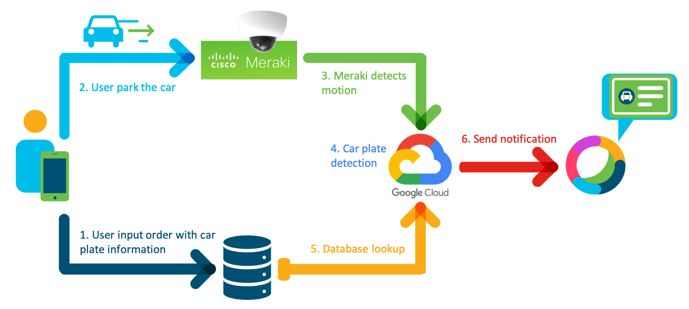

# Meraki Car Plate Recognition and Webex Notification For Pickup Order

This code run a local server that will recognize a car registration plate whenever Meraki MV camera detect a motion related to a vehicle. This event will also trigger a Webex notification.


---

The following diagram describes the use case overview.


The following diagram describes the PoV high level design.




## Contacts
* Hung Le (hungl2@cisco.com)
* Muhammad Akbar (muakbar@cisco.com)
* Swati Singh (swsingh3@cisco.com)
* Alvin Lau (alvlau@cisco.com)


## Solution Components
* Camera: MV12
* Local server: Flask
* Database system: JSON-server
* Optical character recognition (OCR): Google Vision API
* Messaging: Webex


## Workflow


# Getting Started
## Requirements
- [Flask](https://flask.palletsprojects.com/en/1.1.x/installation/)
- [JSON-server](https://github.com/typicode/json-server)
- [ngrok](https://ngrok.com/download)
- [Meraki Dashboard API](https://pypi.org/project/meraki/)
- Webex: [API](https://developer.webex.com) and [Adaptive Cards](https://developer.webex.com/buttons-and-cards-designer)


## Google Vision API setup
- [OCR setup guide](https://cloud.google.com/vision/docs/ocr)
- [Python setup instruction](https://cloud.google.com/vision/docs/quickstart-client-libraries)


## Step-by-step instructions

### Receiving Meraki motion alert webhook
1. Clone the repository.
2. Setup and install all the requirements - optionally, use venv to isolate the project.
```
python -m venv myvenv
python -m pip install -r requirements.txt
```
3. Complete the setup of Google Vision API.
4. In local repository folder, create a file named `.env` where we define environment variables. This .env file must contain:
   1. `MV_SHARED_KEY = 'YOUR MERAKI SHARED SECRET KEY'` > we set this up in Meraki webhook alert setting. We will touch on this in step 7.
   2. `MV_API_KEY = 'YOUR MERAKI API KEY'` > we get the key from Meraki profile setting.
   3. `DB_HOST = 'JSON-SERVER LOCALHOST ADDRESS'` > local address+port where the JSON-server is running (e.g., 'http://localhost:3000'). To find out what local address our machine use, we will touch on this in step 8.
   4. `GOOGLE_APPLICATION_CREDENTIALS = 'service-account-file.json'` > service account json file path. The file is generated when we setup the Google Vision API.
   5. `WEBEX_TOKEN = 'YOUR WEBEX BOT TOKEN'` > from New Bot [link](https://developer.webex.com/my-apps/new/bot) - Building Apps
   6. `WEBEX_ROOM_ID = 'YOUR WEBEX ROOM ID'` > Webex room where we want the notification to be sent. Room id can be found in [Webex room list](https://developer.webex.com/docs/api/v1/rooms/list-rooms).
   7. `NGROK_URL = 'YOUR NGROK HTTPS ADDRESS'` > Address created in step 6.2.
5. Run flask server
   ```
   python flask_server.py
   ```
   1. Once completed, we should be able to see the localhost address+port where the Flask app is running (e.g. "Running on http://127.0.0.1:5000/"). Take note of the port number for the next step.
6. Run ngrok server
   ```
   ngrok http 5000
   ```
   1. This is based on which port the Flask server is running in step 5.1. In this example it is port 5000.
   2. Once completed, we should be able to see publicly available link that translates the localhost address in step 5.1 to a publicly available https url (e.g., https://XXXXXXXXXXXX.ngrok.io). Update the `NGROK_URL` in `.env` file with the same one.
7. Set up Meraki webhook to subscribe to motion alert event in Meraki MV by going to Meraki dashboard >> Alerts >> Webhook setting >> insert the ngrok url from step 6.2 as webhook endpoint, with `/webhook` appended to the url (e.g., https://XXXXXXXXXXXX.ngrok.io/webhook).
   1. In the webhook option, set up a shared secret key and update the `MV_SHARED_KEY` in `.env` file with the same one.
   2. Still in the same page, add this new webhook profile to the custom recipient list for motion alerts.
8. Run JSON-server database. Dummy entries in the database has been set up when we clone this repository.
   ```
   json-server db_server.json
   ```
   1. Once completed, we should be able to see the localhost address where the database server is running (e.g., 'http://localhost:3000'). Update the `DB_HOST` in `.env` file with this address.
9.  Optionally, edit and/or use `user_input_dummy.py` as a dummy json data from customer input, on a mobile app for example, that will be sent to the order database in JSON-server. We can also use Postman for this process.
10.  Test if the Flask server is ready to receive a Meraki motion alert webhook and trigger the plate detection process.


### Receiving Webex card button (actions) webhook
1. Create Webex webhook to subscribe to card button action by running `create_webex_webhook.py`, or by using [webhook creation](https://developer.webex.com/docs/api/v1/webhooks/create-a-webhook)  in developer website.
2. Once the webhook is created, test it by pressing Process Order or Discard Order button in Webex notification card. It should change the `serviced` status in the JSON-server order database.

